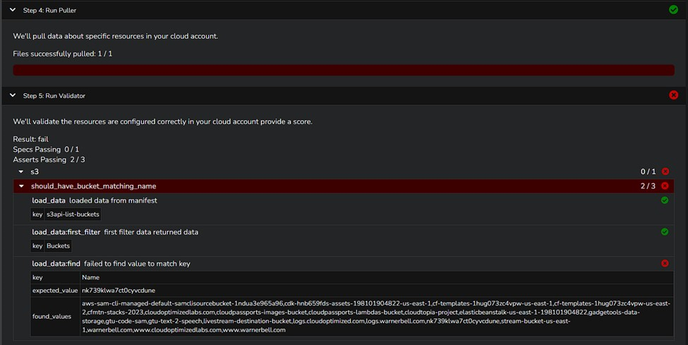
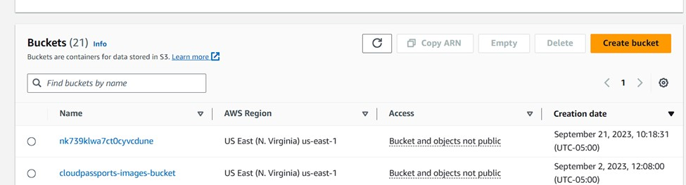
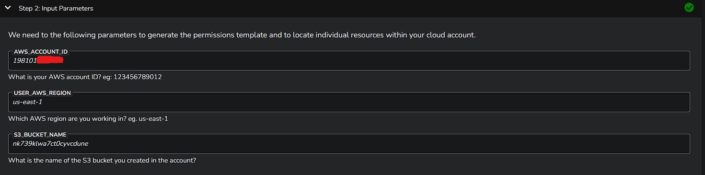
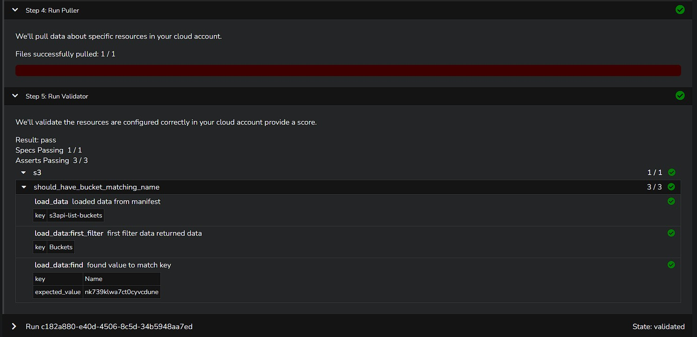

# Terraform-Bootcamp-Week-0

# Table of Contents

1. [Terraform Bootcamp Week 0](#Terraform-Bootcamp-Week-0)
2. [Semantic Versioning :mage:](#semantic-versioning-mage)
3. [Installing the Terraform CLI](#installing-the-terraform-cli)
   - [Considerations with the Terraform CLI changes](#considerations-with-the-terraform-cli-changes)
   - [Considerations for Linux Distribution](#considerations-for-linux-distribution)
   - [Refactoring .tf Install to Bash](#refactoring-tf-install-to-bash)
4. [Shebang Considerations](#shebang-considerations)
5. [Execution Considerations](#execution-considerations)
6. [Linux Permissions Considerations](#linux-permissions-considerations)
7. [Github Lifecycle (Before, Init, Command)](#github-lifecycle-before-init-command)
8. [Working Env Vars](#working-env-vars)
   - [env command](#env-command)
   - [Setting and Unsetting Env Vars](#setting-and-unsetting-env-vars)
   - [Printing Vars](#printing-vars)
   - [Scoping of Env Vars](#scoping-of-env-vars)
   - [Persisting Env Vars in Gitpod](#persisting-env-vars-in-gitpod)
9. [AWS CLI Installation](#aws-cli-installation)
10. [Terraform Basics](#terraform-basics)
    - [Terraform Registry](#terraform-registry)
    - [Terraform Console](#terraform-console)
    - [Terraform Init](#terraform-init)
    - [Terraform Plan](#terraform-plan)
    - [Terraform Apply](#terraform-apply)
    - [Terraform Destroy](#terraform-destroy)
    - [Terraform Lock Files](#terraform-lock-files)
    - [Terraform State Files](#terraform-state-files)
    - [Terraform Directory](#terraform-directory)
11. [Issues with Terraform Cloud Login and Gitpod Workspace](#issues-with-terraform-cloud-login-and-gitpod-workspace)
12. [Week 0 Validation](#week-0-validation)
    - [Run Validation on week 0 deployment](#run-validation-on-week-0-deployment)
    - [Issues Running the Validator](#issues-running-the-validator)
    - [Investigation](#investigation)
    - [Result](#result)
    - [Determination & Next Action](#determination--next-action)
    - [Take Aways](#take-aways)


## Semantic Versioning :mage:
This project will use semantic versioning for tagging
[semver.org](https://semver.org/)

The general format:

Given a version number **MAJOR.MINOR.PATCH**, eg. `1.0.1`

- **MAJOR** version when you make incompatible API changes
- **MINOR** version when you add functionality in a backward compatible manner
- **PATCH** version when you make backward compatible bug fixes

## Installing the Terraform CLI

### Considerations with the Terraform CLI changes

The Terraform CLI installation instructions have changed due to gpg keyring changes. So we needed refer to the latest install CLI instructions via Terraform Documentation and change the scripting for install.

[Install Terraform CLI](https://developer.hashicorp.com/terraform/tutorials/aws-get-started/install-cli)

### Considerations for Linux Distribution
This project is built against Ubunutu distro. Please consider checking your Linux Distrubtion and change accordingly to distrubtion needs.

How To Check OS Version in Linux

[Checking The Linux Version](https://www.cyberciti.biz/faq/how-to-check-os-version-in-linux-command-line/)

Example of checking OS Version:
```
$ cat /etc/os-release

PRETTY_NAME="Ubuntu 22.04.3 LTS"
NAME="Ubuntu"
VERSION_ID="22.04"
VERSION="22.04.3 LTS (Jammy Jellyfish)"
VERSION_CODENAME=jammy
ID=ubuntu
ID_LIKE=debian
HOME_URL="https://www.ubuntu.com/"
SUPPORT_URL="https://help.ubuntu.com/"
BUG_REPORT_URL="https://bugs.launchpad.net/ubuntu/"
PRIVACY_POLICY_URL="https://www.ubuntu.com/legal/terms-and-policies/privacy-policy"
```

### Refactoring .tf Install to Bash

[Bash Syntax Info](https://en.wikipedia.org/wiki/Shebang_(Unix))

While investigating Terriform CLI gpg issues, we noticed the short form install commands for terraform were a bit out of date so we got theupdated version from [hasicorp](https://developer.hashicorp.com/terraform/tutorials/aws-get-started/install-cli) and compiled it into a bash script --> [Terraform-Install](./bin/install_tf_cli.sh). 

## Shebang Considerations
A Shebang (prounced Sha-bang) tells the bash script what program that will interpet the script. eg. #!/bin/bash

ChatGPT recommended this format for bash: #!/usr/bin/env bash

for portability for different OS distributions
will search the user's PATH for the bash executable
https://en.wikipedia.org/wiki/Shebang_(Unix).

## Execution Considerations
To execute a bash script we can use the ./ (shorthand notiation to execute the bash script).

eg. ./bin/install_tf_cli.sh

If we are using a script in .gitpod.yml we need to point the script to a program to interpert it.

eg. source ./bin/install_tf_cli.sh

## Linux Permissions Considerations
To make the bash scripts executable change linux permission so it will be exetuable at the user mode.

chmod u+x ./bin/install_tf_cli.sh

### alternatively:
chmod 744 ./bin/install_tf_cli.sh
https://en.wikipedia.org/wiki/Chmod

## Github Lifecycle (Before, Init, Command)
Note: The Init will not rerun if we restart an existing workspace, so the "before" command would need to be used.

https://www.gitpod.io/docs/configure/workspaces/tasks

## Working Env Vars
#### env command

We can list out all Enviroment Variables (Env Vars) using the `env` command

We can filter specific env vars using grep eg. `env | grep AWS_`

### Setting and Unsetting Env Vars
In the terminal we can set using 
``` 
export HELLO='world' 
```

In the terrminal we unset using 
```
unset HELLO
```

We can set an env var temporarily when just running a command
```
HELLO='world' ./bin/print_message
```
Within a bash script we can set env without writing export eg.
```
#!/usr/bin/env bash

HELLO='world'

echo $HELLO
```

#### Printing Vars
We can print an env var using echo eg. `echo $HELLO`

#### Scoping of Env Vars
When you open up new bash terminals in VSCode it will not be aware of env vars that you have set in another window.

If you want to Env Vars to persist across all future bash terminals that are open you need to set env vars in your bash profile. eg. `.bash_profile`

#### Persisting Env Vars in Gitpod
We can persist env vars into gitpod by storing them in Gitpod "Codespaces secrets".

```
gp env HELLO='world'
```
All future workspaces launched will have the env vars already set for all bash terminals opened in those workspaces.

You can also set en vars in the .gitpod.yml but they should only be non-senstive env vars.

## AWS CLI Installation

AWS CLI is installed for the project via the bash script `./bin/install_aws_cli`

{Getting Started](https://docs.aws.amazon.com/cli/latest/userguide/getting-started-install.html)-We'll need to generate [AWS CLI keys](https://us-east-1.console.aws.amazon.com/iamv2/home?region=us-east-1#/security_credentials) for IAM User in order to the user AWS CLI.

Install (AWS CLI) [AWS CLI Env Vars](https://docs.aws.amazon.com/cli/latest/userguide/cli-configure-envvars.html)

We can check if our AWS credentials are configured correctly by running the following AWS CLI command:
```
aws sts get-caller-identity
```
If it is succesful you should see a json payload return that looks like this:
```
{
    "UserId": "AIEAVUO15ZPVHJ5WIJ5KR",
    "Account": "123456789012",
    "Arn": "arn:aws:iam::123456789012:user/<IAM User Name>"
}
```

## Terraform Basics
### Terraform Registry
Terraform sources its providers and modules from the Terraform registry which located at [registry.terraform.io](https://registry.terraform.io/)

- **Providers** is an interface to APIs that will allow you to create resources in terraform.
- **Modules** are a way to make large amount of terraform code modular, portable and sharable.

[Randon Terraform Provider](https://registry.terraform.io/providers/hashicorp/random)

### Terraform Console
You can see a list of all the Terrform commands by simply typing `terraform`

#### Terraform Init
At the start of a new terraform project we will run `terraform init` to download the binaries for the terraform providers that we'll use in this project.

#### Terraform Plan

`terraform plan`


This will generate out a changeset, about the state of our infrastructure and what will be changed.

We can output this changeset ie. "plan" to be passed to an apply, but often you can just ignore outputting.

#### Terraform Apply

`terraform apply`

This will run a plan and pass the changeset to be executed by terraform. Apply should prompt yes or no.

If you want to automatically approve an apply we can provide the auto approve flag eg. `terraform apply --auto-approve`

#### Terraform Destroy
`teraform destroy` This will destroy resources.

You can use the auto approve flag to skip the approve prompt eg. `terraform apply --auto-approve`

### Terraform Lock Files
`.terraform.lock.hcl` contains the locked versioning for the providers or modulues that should be used with the project.

The Terraform Lock File should be committed to your Version Control System (VCS) eg. Github

### Terraform State Files
`.terraform.tfstate` contain information about the current state of your infrastructure.

This file *should not be commited* to your VCS.

This file can contain sensentive data.

If you lose this file, you lose knowning the state of your infrastructure.

`.terraform.tfstate.backup` is the previous state file state.

### Terraform Directory
`.terraform` directory contains binaries of terraform providers..

## Issues with Terraform Cloud Login and Gitpod Workspace
When attempting to run terraform login it will launch bash a wiswig view to generate a token. However it does not work expected in Gitpod VsCode in the browser.

The workaround is manually generate a token in Terraform Cloud

`https://app.terraform.io/app/settings/tokens?source=terraform-login`

Then create open the file manually here:

```
touch /home/gitpod/.terraform.d/credentials.tfrc.json
open /home/gitpod/.terraform.d/credentials.tfrc.json
```

Provide the following code (replace your token in the file):

```
{
  "credentials": {
    "app.terraform.io": {
      "token": "YOUR-TERRAFORM-CLOUD-TOKEN"
    }
  }
}
```

We have automated this workaround with the following bash script [bin/generate_tfrc_credentials](bin/generate_tfrc_credentials)

## Week 0 Validation

### Run Validation on week 0 deployment

- Step 1: Check the box if you agree to the terms of the access agreement.
- Step 2: Input the required parameters eg. AWS_ACCOUNT_ID, USER_AWS_REGION, S3_BUCKET_NAME.
- Step 3: Setup Permissions by deploying generated cloudformation template or running the generated api command.
- Step 4: Run the puller to pull specific data about the scoped resources in your cloud account.
- Step 5: Run the validator to verify the scoped resources are configured correctly.

The validator will check for passing specs, and passing asserts.

## Issues Running the Validator
After inputting the required information and running the validator `Run c182a880-e40d-4506-8c5d-34b5948aa7ed`.

A "fail" result was returned with 0/1 specs passing and 2/3 asserts passing. The files were pulled successfully and the validator did run, however it was unable to find the bucket name I input in step 2.



### Investigation
After recieving the "fail" result and reviewing the output and stated reason for the fail, I verified that the bucket was indeed visible in my AWS account, and that I did use the bucket name and not some other identifier in step 2.


### Result
I was able to verify the bucket resource existing in the account and that the bucket name was in fact the identifier I used in step 2, furthermore I verified that the name was correctly input into the correct field in the validator step 2 and all other parameters were indeed correct.


### Determination & Next Action
After final review and ponderance of the results, I determined that the initial "fail" result is likely due to a false negative and that the next course of action should be to run the validator again.

I went thorough the validation process a second time `
Run 42554b11-f698-4f4e-8552-3413938b39d4`

I completed the steps will the exact same information as was input in the initial run, this time taking extra care with the bucket name making sure there were no leading/trailing spaces or arrant letters. (not that I suspect that was the case initially...but...).

This time the validator completed with a "pass" result, which seemed to confirm my initial suspicion of the validator being suceptable to false positives/negatives.


### Take Aways
It's a good thing multiple run attempts are given regarding validation, for situations such as this and other anomalous behaviors that are not uncommon when dealing with cloud technology, various equipment, platforms, and OSs.

Special care should be taken when inputting and even copy pasting data, mistakes happen and weird things can surely crop up when pasting between different mediums.

Scrutinize thorougly, sometimes you had it right the first time, you could easily find yourself lost down a rabbit hole trouble shooting a non issue becuase you recieved a ghost erroneous result. 