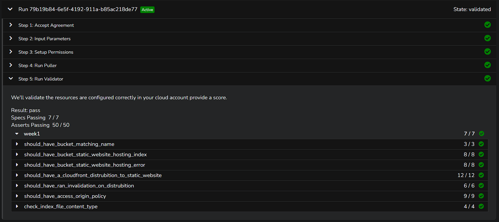

# Terraform-Bootcamp 2023 - Week 1

## Fixing Tags

[How to Delete Local and Remote Tags on Git](https://devconnected.com/how-to-delete-local-and-remote-tags-on-git/)

Locall delete a tag
```sh
git tag -d <tag_name>
```

Remotely delete tag

```sh
git push --delete origin tagname
```

Checkout the commit that you want to retag. 

Grab the sha from your Github history.

```sh
git checkout <SHA>
git tag M.M.P
git push --tags
git checkout main
```

## Root Module Structure

Our root module structure is as follows:
```
PROJECT_ROOT
│
├── main.tf                 # everything else.
├── variables.tf            # stores the structure of input variables
├── terraform.tfvars        # the data of variables we want to load into our terraform project
├── providers.tf            # defined required providers and their configuration
├── outputs.tf              # stores our outputs
└── README.md               # required for root modules
```
[Standard Modular Structure](https://developer.hashicorp.com/terraform/language/modules/develop/structure)


## Terraform and Input Variables
### Terraform Cloud Variables
In terraform we can set two kind of variables:

- Enviroment Variables - those you would set in your bash 
- terminal eg. AWS credentials
Terraform Variables - those that you would normally set in your tfvars file

We can set Terraform Cloud variables to be sensitive so they are not shown visibliy in the UI.

### Loading Terraform Input Variables
[Terraform Input Variables](https://developer.hashicorp.com/terraform/language/values/variables)

### var flag
We can use the `-var` flag to set an input variable or override a variable in the tfvars file eg. `terraform -var user_ud="my-user_id"`

### var-file flag
- TODO: document this flag

### terraform.tvfars

This is the default file to load in terraform variables in blunk.

### auto.tfvars
- TODO: document this functionality for terraform cloud.

### order of terraform variables
- TODO: document which terraform variables takes presendence.

## Dealing With Configuration Drift

## What happens if we lose our state file?

If you lose your statefile, you most likley have to tear down all your cloud infrastructure manually.

You can use "terraform import" but it won't for all cloud resources. You need check the terraform providers documentation for which resources support import.

### Fix Missing Resources with Terraform Import

`terraform import aws_s3_bucket.bucket bucket-name`

[Terraform Import](https://developer.hashicorp.com/terraform/cli/import)

[AWS S3 Bucket Import](https://registry.terraform.io/providers/hashicorp/aws/latest/docs/resources/s3_bucket#import)

### Fix Manual Configuration

If someone goes and deletes or modifies cloud resources manually through ClickOps. 

If we run Terraform plan is with attempt to put our infrstraucture back into the expected state fixing Configuration Drift

## Fix using Terraform Refresh

```
terraform apply -refresh-only -auto-approve
```

## Terraform Modules

### Terraform Module Structure

It is recommend to place modules in a `modules` directory when locally developing modules but you can name it whatever you like.

### Passing Input Variables

We can pass input variables to our module.

The module has to declare the terraform variables in its own variables.tf

```
module "terrahouse_aws" {
  source = "./modules/terrahouse_aws"
  user_uuid = var.user_uuid
  bucket_name = var.bucket_name
}
```

### Modules Sources

Using the source we can import the module from various places eg:
- locally
- Github
- Terraform Registry

```
module "terrahouse_aws" {
  source = "./modules/terrahouse_aws"
}
```

[Modules Sources](https://developer.hashicorp.com/terraform/language/modules/sources).

## Considerations when using ChatGPT to write Terraform

LLMs such as ChatGPT may not be trained on the latest documentation or information about Terraform.

It may likely produce older examples that could be deprecated. Often affecting providers.

## Working with Files in Terraform


### Fileexists function

This is a built in terraform function to check the existance of a file.

```
condition = file exists(var.error_html_filepath)
```

https://developer.hashicorp.com/terraform/language/functions/fileexists

### Filemd5

https://developer.hashicorp.com/terraform/language/functions/filemd5

### Path Variable

In terraform there is a special variable called `path` that allows us to reference local paths:
- path.module = get the path for the current module
- path.root = get the path for the root module
[Special Path Variable](https://developer.hashicorp.com/terraform/language/expressions/references#filesystem-and-workspace-info)

``````
resource "aws_s3_object" "index_html" {
  bucket = aws_s3_bucket.website_bucket.bucket
  key    = "index.html"
  source = "${path.root}/public/index.html"
}
``````

## Terraform Locals

Locals allow you to define local variables.
It can be very useful when you need transform data into another format and have a referenced varaible.

```
locals {
  s3_origin_id = "MyS3Origin"
}
```
[Local Values](https://developer.hashicorp.com/terraform/language/values/locals)

## Terraform Data Sources

This allows you to source data from cloud resources.

This is useful when you want to reference cloud resources without importing them.

```
data "aws_caller_identity" "current" {}
output "account_id" {
  value = data.aws_caller_identity.current.account_id
}
```
[Data Sources](https://developer.hashicorp.com/terraform/language/data-sources)

## Working with JSON

We use the json-encode to create the json policy inline in the hcl.

```
> jsonencode({"hello"="world"})
{"hello":"world"}
```

[jsonencode](https://developer.hashicorp.com/terraform/language/functions/jsonencode)

### Changing the Lifecycle of Resources

[Meta Arguments Lifcycle](https://developer.hashicorp.com/terraform/language/meta-arguments/lifecycle)


## Terraform Data

Plain data values such as Local Values and Input Variables don't have any side-effects to plan against and so they aren't valid in replace_triggered_by. 

You can use terraform_data's behavior of planning an action each time input changes to indirectly use a plain value to trigger replacement.

https://developer.hashicorp.com/terraform/language/resources/terraform-data

## Provisioners

Provisioners allow you to execute commands on compute instances eg. a AWS CLI command.

They are not recommended for use by Hashicorp because Configuration Management tools such as Ansible are a better fit, but the functionality exists.

[Provisioners](https://developer.hashicorp.com/terraform/language/resources/provisioners/syntax)

### Local-exec

This will execute command on the machine running the terraform commands eg. plan apply

```
resource "aws_instance" "web" {
  # ...
  provisioner "local-exec" {
    command = "echo The server's IP address is ${self.private_ip}"
  }
}
```

https://developer.hashicorp.com/terraform/language/resources/provisioners/local-exec

### Remote-exec

This will execute commands on a machine which you target. You will need to provide credentials such as ssh to get into the machine.

```
resource "aws_instance" "web" {
  # ...
  # Establishes connection to be used by all
  # generic remote provisioners (i.e. file/remote-exec)
  connection {
    type     = "ssh"
    user     = "root"
    password = var.root_password
    host     = self.public_ip
  }
  provisioner "remote-exec" {
    inline = [
      "puppet apply",
      "consul join ${aws_instance.web.private_ip}",
    ]
  }
}
```
https://developer.hashicorp.com/terraform/language/resources/provisioners/remote-exec

https://developer.hashicorp.com/terraform/language/resources/provisioners/remote-exec

## For Each Expressions

For each allows us to enumerate over complex data types

```
[for s in var.list : upper(s)]
```

This is mostly useful when you are creating multiples of a cloud resource and you want to reduce the amount of repetitive terraform code.

[For Each Expressions](https://developer.hashicorp.com/terraform/language/expressions/for)

## Terraform Console

- `tf init`-- just to be sure terraform is initialized.
- `tf console`-- to access the terraform console.
- `path.root`-- to find out where the root path is. 
- `fileset("${path.root}/public/assets", "*")`-- to find and display files in a particular directory.
- `fileset("${path.root}/public/assets", "*.{jpg,png,gig}")`-- to find and display certain files in a partricular directory.

## Week 1 Validation

### Run Validation on week 0 deployment

- Step 1: Check the box if you agree to the terms of the access agreement.
- Step 2: Input the required parameters eg. AWS_ACCOUNT_ID, USER_AWS_REGION, S3_BUCKET_NAME.
- Step 3: Setup Permissions by deploying generated cloudformation template or running the generated api command.
- Step 4: Run the puller to pull specific data about the scoped resources in your cloud account.
- Step 5: Run the validator to verify the scoped resources are configured correctly.

The validator will check for passing specs, and passing asserts.

### Result
`Run 79b19b84-6e5f-4192-911a-b85ac218de77`

Validator passed all checks aon first run.

