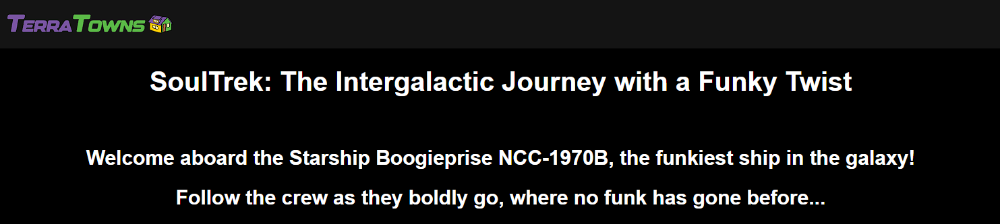
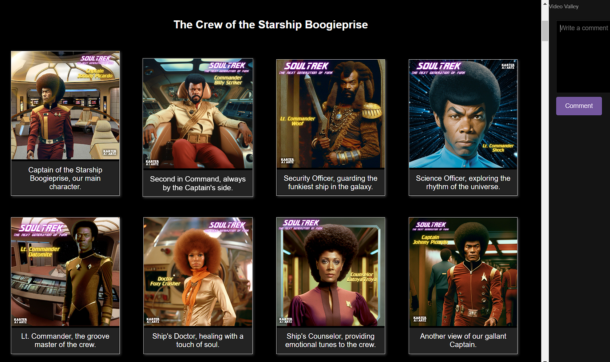

# Terraform-Bootcamp 2023 - Week 2

## Working with Ruby

### Bundler

Bundler is a package manager for ruby.
It is the primary way to install ruby packages (known as gems) for ruby.

#### Install Gems

You need to create a Gemfile and define your gems in that file.

```
source "https://rubygems.org"

gem 'sinatra'
gem 'rake'
gem 'pry'
gem 'puma'
gem 'activerecord'
```

Then you need to run the `bundle install` command

This will install the gems on the system globally (unlike nodejs which install packages in place in a folder called node_modules)

A Gemfile.lock will be created to lock down the gem versions used in the project.

#### Executing ruby scripts in the context of bundler

We have to use `bundle exec` to tell future ruby scripts to use the gems we installed. This is the way we set context.

### Sinatra

Sinatra is a micro web-framework for ruby to build web-apps.

Its great for mock or development servers or for very simple projects.

You can create a web-server in a single file.

https://sinatrarb.com/

## Terratowns Mock Server

### Running the web server

We can run the web server by executing the following commands:

```
bundle install
bundle exec ruby server.rb
```

All of the code for our server is stored in the `server.rb` file.


## Terraform Provider

### Go-App
To create a go app for the custom terraform provider a main.go file must be created for the package. In github go is installed by default so there was no need to manually install, we initialized by running
```
go run main.go
```

Two other files need to be created `go.mod` and `.terraformrc` created in the root of the project. After building the code we complile with a bash script we name `build_provider`. To compile the build package run 
```
go build -o terraform-provider-terratowns_v1.0.0
```
a `go.sum` file and a large binary will be generated, and the name to .gitignore.

### Configure Provider
The required providers block should be included.
```
required_providers {
    terratowns = {
      source = "local.providers/local/terratowns"
      version = "1.0.0"
    }
  }
 }

```
An example of the provider configuration including the module and resource blocks looks like this.
```
 module "home_rccars_hosting" {
   source = "./modules/terrahome_aws"
   user_uuid = var.teacherseat_user_uuid
   public_path = var.rccars.public_path
   bucket_name = var.bucket_name
   content_version = var.rccars.content_version
 }

 resource "terratowns_home" "home_rccars" {
   name = "RC Cars & Trucks"
   description = <<DESCRIPTION
 There are some really cool and fun rc vehicles out there these days.
 DESCRIPTION
   domain_name = module.home_rccars_hosting.domain_name
   #domain_name = "4ytq3gz.cloudfront.net"
   town = "missingo"
   content_version = var.rccars.content_version
 }
```
### CRUD

Terraform Provider resources utilize CRUD.

CRUD stands for Create, Read, Update, and Delete

https://en.wikipedia.org/wiki/Create,_read,_update_and_delete

Added the code to the `main.go` file for Create, Read, Update, Delete actions.

## Deploying to Terratowns
Testing terratowns deployments in `missingo` town to validate configs and prepare for final deployment.
```
https://terratowns.cloud/t/missingo
```
Refactor code to use variables instead of hardcoded inputs.

## Deploy Finished Terratown Into Appropriate Space
```
"SoulTrek 2023"

Soul Trek is a meme style pop culture parody adaptation of the science fiction tv series Star Trek TNG,that followed the crew of a new starship Enterprise a century after the original series.
Soul Trek a series of images spoofing the characters and themes of the TNG tv series, explores the world of intergalactic space travel with an element of funk. 
Town Concept Created by Warner Bell, Images Created by Karter AI Artz.

```






